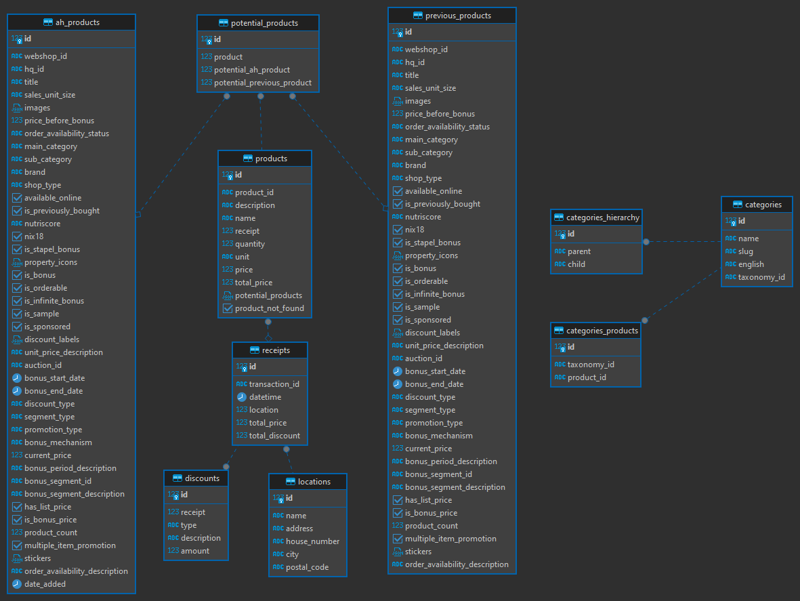

# Receipt Parser (or something like that)

## Requirements

- Python 3 (I tested it only on 3.10)

## How to

This application is using the API for the mobile AH app. Thanks to Rutgerdj for getting me started on the undocumented API, otherwise I'd have to do it with OCR...

- Install dependencies with `pip install -r requirements.txt`
- Adjust the `config.yml` file. The only thing that is required is `api.code`, which needs to be fetched as follows:
  - Visit https://login.ah.nl/secure/oauth/authorize?client_id=appie&redirect_uri=appie://login-exit&response_type=code
  - Open the dev tools and go to the network tab
  - Enter your credentials on the website and login. The page might not change at all but new requests in the network tab will appear.
  - Filter the requests for status code 303
  - In the response header of the request, look for `location`. The value that comes after `?code=` is the code that needs to be put into `api.code`
- Run `main.py`, for example `python main.py`

### Todo

- [ ] Discount not bound to any products
- [ ] Frontend

### ER Diagram

